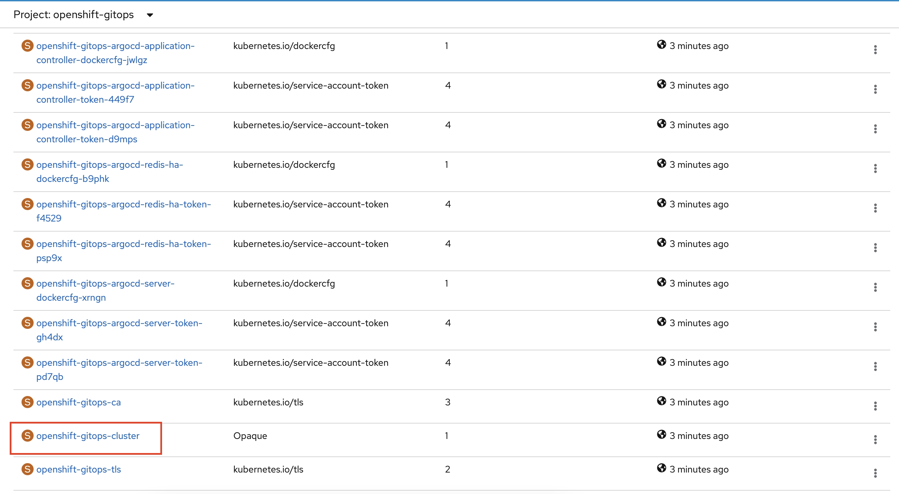

## Why SSO?


## What are you options for OpenShift AuthN/AuthZ?


## Hands-On: SSO using RHSSO operator for ArgoCD apps

### Pre-requisites
- OpenShift 4.X cluster
- Installation of the following operators
  - Red Hat Single Sign-On (RHSSO) Operator
  - Red Hat OpenShift GitOps 

You can install the RHSSO operator under `keycloak` namespace and can use all other default settings when installing the above operators.

### Steps

Connect to your OpenShift 4.X cluster from command-line so that you can execute `oc` commands.

1. Creating Keycloak CRs

```
oc apply -n keycloak -f https://raw.githubusercontent.com/keycloak/keycloak-quickstarts/latest/operator-examples/mykeycloak.yaml
```

RHSSO Operator uses KeycloakRealm Custom Resources to create and manage Realm resources. Next, create a Keycloak Realm (not using the default `master` realm):

```
oc apply -n keycloak -f https://raw.githubusercontent.com/keycloak/keycloak-quickstarts/latest/operator-examples/myrealm.yaml
```

The following command will create a new User within Keycloak Realm matched by realmSelector. The newly created User will have username set to "myuser" and password set to "12345":
```
oc -n keycloak apply -f https://raw.githubusercontent.com/keycloak/keycloak-quickstarts/latest/operator-examples/myuser.yaml
```
2. Access the Keycloak admin console

Before logging into the Keycloak Admin Console, you need to check what is the Admin Username and Password:

```
oc -n keycloak get secret credential-mykeycloak -o go-template='{{range $k,$v := .data}}{{printf "%s: " $k}}{{if not $v}}{{$v}}{{else}}{{$v | base64decode}}{{end}}{{"\n"}}{{end}}'
```

Now, run the following block of code to find out important Keycloak URLs:

```
KEYCLOAK_URL=https://$(oc -n keycloak get route keycloak --template='{{ .spec.host }}')/auth &&
echo "" &&
echo "Keycloak:                 $KEYCLOAK_URL" &&
echo "Keycloak Admin Console:   $KEYCLOAK_URL/admin" &&
echo "Keycloak Account Console: $KEYCLOAK_URL/realms/myrealm/account" &&
echo ""
```
Navigate to the Keycloak Admin console and make sure that you can log in using the admin credentials from the previous step.

3. Accessing the out-of-the-box ArgoCD instance

On installation of the OpenShift GitOps Operator, the operator sets up an out-of-the-box (OOTB) ArgoCD for cluster configuration.   You can launch into this ArgoCD instance from Console Application Launcher (screenshot below) or from the topology view.


For the pre-created ArgoCD instance under openshift-gitops project, find the password by following these steps:

- Switch to the developer perspective
- Navigate to the “openshift-gitops” project
- Go to “Secrets” tab and find the secret `<argocd-instance-name>-cluster` e.g. “argocd-cluster-cluster” in this case




- Copy the secret and log in to the OOTB ArgoCD server using `admin` and that secret

Alternatively, you may fetch the same using the command line (be sure to update the name of the secret if using a different ArgoCD instance):

```
oc get secret argocd-cluster-cluster -n openshift-gitops -o jsonpath='{.data.admin\.password}' | base64 -d
```

At this point, you'll still see the default login screen with no option for SSO.


4. Creating a new client in Keycloak

First we need to set up a new Keycloak client. Start by logging into your Keycloak server, select the realm you want to use (myrealm is the one we just created) and then go to **Clients** and click the **create** button top right.


Be sure to change the root URL to your ArgoCD server URL. Once you click `Save`, configure the client according to the following:


If you've filled-out the `Root URL` before, some of the fields would be pre-populated. The important fields to note are the `Access Type` which is set to `confidential` and `Base URL` which is set to `/applications`.

Make sure to click `Save`. You should now have a new tab called `Credentials`. You can copy the `Secret` that we'll use in our ArgoCD configuration later.


5. Configuring the groups claim

In order for ArgoCD to provide the groups the user is in we need to configure a groups claim that can be included in the authentication token. To do this we'll start by creating a new `Client Scope` called `groups`.


Once you've created the client scope you can now add a Token Mapper which will add the groups claim to the token when the client requests the groups scope. Make sure to set the Name as well as the Token Claim Name to `groups` and the Mapper Type as `Group Membership`.


We can now configure the client to provide the `groups` scope. You can now assign the groups scope either to the `Assigned Default Client Scopes` or to the `Assigned Optional Client Scopes`. If you put it in the Optional category you will need to make sure that ArgoCD requests the scope in it's OIDC configuration. Let's use `Assigned Default Client Scopes` by selecting `groups` from the `Available Client Scopes` and clicking `Add selected` option.


6. Adding current user to ArgoCDAdmins group
   
Create a group called `ArgoCDAdmins` and have your current user join the group.


7. Configuring ArgoCD OIDC

Let's start by storing the client secret you generated earlier in step4 in the argocd secret `argocd-secret` under `openshift-gitops` project.

First you'll need to encode the client secret in base64:
```
$ echo -n '83083958-8ec6-47b0-a411-a8c55381fbd2' | base64
```
> Be sure to replace the above sample secret with your base64 client secret
 
 From the developer perspective under `openshift-gitops` project, go to `Secrets` tab and click on `argocd-secret`. Click on `YAML` and add the following value under `spec/data` section:

```
oidc.keycloak.clientSecret: <add the base64 client secret here>
```
Click `Save`.

Next, go to `ConfigMaps` tab and click on `argocd-cm`. Add the following codeblock under `spec` section:

```
oidcConfig: |
    name: Keycloak
    issuer: https://keycloak.example.com/auth/realms/myrelam
    clientID: argocd
    clientSecret: $oidc.keycloak.clientSecret
    requestedScopes: ["openid", "profile", "email", "groups"]
```
> Make sure that: `issuer` ends with the correct realm (in this example myrealm), `clientID` is set to the Client ID you configured in Keycloak, `clientSecret` points to the right key you created in the `argocd-secret` secret and `requestedScopes` contains the groups claim if you didn't add it to the Default scope.

8. Login via Keycloak

At this step, you can refresh the ArgoCD server login page and you will see a **LOGIN VIA KEYCLOAK** button. You can use `myuser/12345` credential to log in. This is the keycloak user we created in step1.

9. Create an OpenShift OAuthClient

Create and modify the following YAML:

```
kind: OAuthClient
apiVersion: oauth.openshift.io/v1
metadata:
 name: keycloak-broker 
secret: abcd1234 
redirectURIs:
- "<Your keycloak server URL>/auth/realms/myrealm/broker/openshift-v4/endpoint" 
grantMethod: prompt
```
> Be sure to substitute your keycloak server URL under `redirectURIs` field. `abcd1234` is used as a sample secret and you can choose your own

Save the above YAML as oauthclient.yaml and execute:
```
oc apply -f oauthclient.yaml -n keycloak
```

10. Create OpenShift v4 identity provider on keycloak

From the keycloak admin console, go to identity providers tab and create a new `openshift v4` identity provider:


Observe that the `Client ID` and `Client Secret` are coming from the above oauthclient.yaml file. The default scope is set to `user:info` but you can set your desired scope based on the [doc](https://docs.openshift.com/container-platform/3.3/admin_guide/scoped_tokens.html#admin-guide-scoped-tokens-user-scopes). 

The `Base URL` is the openshift API server URL and here is how to find it for your cluster:


Once you enter all the fields according to the screenshot above, hit `Save`.

11. Create OpenShift user via htpasswd

Create a password `12345` for the user `dewan` and stores this info to the file `htpasswd`
```
htpasswd -c -B -b htpasswd dewan 12345
```

While you're connected to your openshift cluster, execute from the terminal:

```
oc create secret generic htpass-secret --from-file=htpasswd=htpasswd -n openshift-config
```

Create the following YAML to add a new oauth CR:

```
apiVersion: config.openshift.io/v1
kind: OAuth
metadata:
  name: cluster
spec:
  identityProviders:
  - name: my_htpasswd_provider
    mappingMethod: claim
    type: HTPasswd
    htpasswd:
      fileData:
        name: htpass-secret
```

Execute:

```
 oc apply -f htpasswd-cr.yaml
```

12. Log in to ArgoCD using OpenShift

Navigate to your ArgoCD server URL (you might need to open this in an incognito window to avoid caching). Once you click **LOGIN VIA OPENSHIFT**, you'll be taken to a keycloak page with a button **OPENSHIFT LOGIN**. Click this button and you'll be redirected to your openshift login page where you can use `dewan/12345` credential to log in (configured via htpasswd).


You will need to authorize access for the first time.


