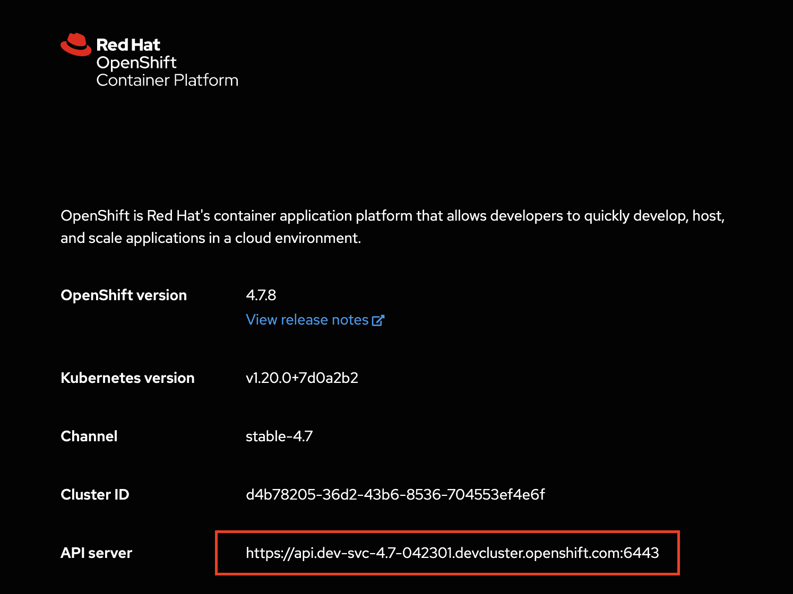

This is a demo-heavy blog. Readers of this blog will get an idea about why SSO is important, how OpenShift handles authN/authZ and a step-by-step guide on using [Red Hat Single Sign-On(RHSSO)](https://access.redhat.com/products/red-hat-single-sign-on) operator to log in to an [ArgoCD](https://argoproj.github.io/argo-cd/) application.

## Why SSO?

[SSO](https://developers.redhat.com/blog/2016/10/04/how-red-hat-re-designed-its-single-sign-on-sso-architecture-and-why/) is the preferred, if not the only, way of authentication for most enterprise applications. From the user perspective, SSO offers speed and convenience i.e. you only need to authenticate once. The most important consideration from the business is the security SSO offers. SSO reduces the attack vector because users only log in via a specific channel. 


## What are the options for OpenShift AuthN/AuthZ?
OpenShift can be used as an identity provider with custom access permissions configured. OpenShift Container Plaform master includes a built-in OAuth server. 
Users/apps obtain OAuth access tokens to authenticate themselves to the API. 

When a new OAuth token is requested, the OAuth server uses the configured identity provider to determine the identity of the person/app making the request and maps a role binding to that identity. This role binding determines what access that person/app is allowed and an associated access token is returned. Every request for an OAuth token must specify the OAuth client that will receive and use the token. This blog focuses on using OpenShift as an identity provider and RHSSO operator as an identity broker. 

## Hands-On: SSO using RHSSO operator for ArgoCD apps

### Pre-requisites
- OpenShift 4.X cluster
- Installation of the following operators
  - Red Hat Single Sign-On (RHSSO) Operator
  - Red Hat OpenShift GitOps 

You can install the RHSSO operator under `keycloak` namespace and can use all other default settings when installing the above operators.

### Steps

Connect to your OpenShift 4.X cluster from command-line so that you can execute `oc` commands.

1. Finding your ArgoCD server route:

```
oc get route <instance-name>-server -n <namespace>
```

For example, for the out-of-the-box (OOTB) ArgoCD instance under openshift-gitops namespace, the command to find the ArgoCD server route is:

```
oc get route openshift-gitops-server -n openshift-gitops
```


2. Creating a new client in Keycloak:

Log in to your Keycloak server, select the realm you want to use, navigate to the **Clients** page, and then click the **Create** button in the upper-right section of the screen. Use the following values

Client ID: `ArgoCD`

Client Protocol: `openid-connect`

Route URL: `<ArgoCD server route obtained in step 1>`

Access Type: `confidential`

Valid Redirect URIs: `<ArgoCD server route obtained in step 1>/auth/callback`

Base URL: `/applications`

Click **Save** and you'll see a new tab being generated called **Credentials**. Copy this credential for now which will be used in a later section.

3. Configuring the **groups** claim

To manage users in Argo CD, you must configure a **groups** claim that can be included in the authentication token.

 To do this, start by creating a new **Client Scope** called `groups` and use the settings from the image below.


Once you've created the client scope you can now add a **Token Mapper** which will add the groups claim to the token when the client requests the groups scope. Make sure to set the **Name** as well as the **Token Claim Name** to `groups`, the **Mapper Type** as `Group Membership` and **Full group path** `OFF`.


You can now configure the client to provide the `groups` scope. You can now assign the groups scope either to the `Assigned Default Client Scopes` or to the `Assigned Optional Client Scopes`. If you put it in the Optional category you will need to make sure that ArgoCD requests the scope in it's OIDC configuration. Let's use `Assigned Default Client Scopes` by navigating to **Clients** → **Client Scopes**, selecting `groups` from the **Available Client Scopes** and clicking `Add selected` option. The groups scope must be in the **Available Client Scopes** table.


4. Creating an **Admin** group

Navigate to **Groups** and create a group called `ArgoCDAdmins`

5. Configuring ArgoCD OIDC

To configure Argo CD OpenID Connect (OIDC), you must generate your client secret, encode it, and add it to your custom resource.

6. Adding current user to ArgoCDAdmins group
   
Create a group called `ArgoCDAdmins` and have your current user join the group.


7. Configuring ArgoCD OIDC

To configure ArgoCD OpenID Connect (OIDC), you must encode your existing client secret (or generate the client secret if you don't have it already), and add it to your custom resource.

a. First you'll need to encode the client secret in base64:
```
$ echo -n '<secret you copied in step 2>' | base64
```

Now edit the secret **argocd-secret** and add the base64 value to an **oidc.keycloak.clientSecret** key:

```
oc edit secret argocd-secret -n <namespace>
```

Example YAML of the secret:

```
yaml apiVersion: v1
kind: Secret
metadata: name: argocd-secret
data:
  oidc.keycloak.clientSecret: ODMwODM5NTgtOGVjNi00N2IwLWE0MTEtYThjNTUzODFmYmQy …
```
b. Next, edit the ArgoCD custom resource and add the OIDC configuration to enable the Keycloak authentication:

```
oc edit argocd -n <your_namespace>
```

Example of ArgoCD custom resource:


```
apiVersion: argoproj.io/v1alpha1
kind: ArgoCD
metadata:
  creationTimestamp: null
  name: argocd
  namespace: argocd
spec:
  resourceExclusions: |
    - apiGroups:
      - tekton.dev
      clusters:
      - '*'
      kinds:
      - TaskRun
      - PipelineRun
  oidcConfig: |
    name: OpenShift Single Sign-On
    issuer: https://<your Keycloak server URL>/auth/realms/<your realm> 
    clientID: argocd 
    clientSecret: $oidc.keycloak.clientSecret 
    requestedScopes: ["openid", "profile", "email", "groups"] 
  server:
    route:
      enabled: true
```

8. Keycloak Identity Brokering with OpenShift

You can configure a Keycloak instance to use OpenShift for authentication through Identity Brokering. This allows for Single Sign-On (SSO) between the OpenShift cluster and the Keycloak instance.

a. You can obtain the OpenShift Container Platform API server URL either from UI or CLI. 

From the top-right corner of the Admin UI console, click on the **?** and you'll see the API server URL like below:



Alternatively, you can execute:

```
oc status
```


b. In the Keycloak server dashboard, navigate to **Identity Providers** and select `Openshift v4`. Specify the following values:

Base Url: `<OpenShift API Server URL obtained above>`

Client ID: `keycloak-broker` (this has to match the name of the OAuth Client specified in step 9)

Client Secret: `12345` (this can be any value you choose but has to match the value of the secret specified in step 9)

Display Name: `Login with OpenShift`

9. Registering an OAuth client

Execute the following YAML to register your OAuth client:

```
oc create -f <(echo '
kind: OAuthClient
apiVersion: oauth.openshift.io/v1
metadata:
 name: keycloak-broker 
secret: "12345" 
redirectURIs:
- "https://<your Keycloak server URL>/auth/realms/<your realm>/broker/openshift-v4/endpoint" 
grantMethod: prompt 
')
```

If the user has not granted access to this client, the grantMethod determines which action to take when this client requests tokens. Specify `auto` to automatically approve the grant and retry the request, or `prompt` to prompt the user to approve or deny the grant.

At this point, you should be seeing a **Login with OpenShift** button on your ArgoCD server UI and be able to use your OpenShift credentials to log in to the ArgoCD server UI.

If you already have an OpenShift user created, you can skip step 10.

10. Creating an OpenShift user via htpasswd (optional)

a. Create a password `12345` for the user `dewan` and stores this info to the file `htpasswd`
```
htpasswd -c -B -b htpasswd dewan 12345
```

b. While you're connected to your openshift cluster, execute from the terminal:

```
oc create secret generic htpass-secret --from-file=htpasswd=htpasswd -n openshift-config
```

c. Create the following YAML to add a new oauth CR:

```
apiVersion: config.openshift.io/v1
kind: OAuth
metadata:
  name: cluster
spec:
  identityProviders:
  - name: my_htpasswd_provider
    mappingMethod: claim
    type: HTPasswd
    htpasswd:
      fileData:
        name: htpass-secret
```

Execute:

```
 oc apply -f htpasswd-cr.yaml
```

11.  Log in to ArgoCD using OpenShift

Navigate to your ArgoCD server URL (you might need to open this in an incognito window to avoid caching). Once you click **LOGIN VIA OPENSHIFT**, you'll be taken to a keycloak page with a button **OPENSHIFT LOGIN**. Click this button and you'll be redirected to your openshift login page where you can use `dewan/12345` credential (or your existing credential) to log in (configured via htpasswd).


You will need to authorize access for the first time.

12. Done? Not quite yet!

Once you login to ArgoCD with <dewan> (or your own) user, you will fail to create a new ArgoCD application because ArgoCD RBAC grants permissions to the user on the basis of which group does it belong to on Keycloak. In the previous steps, you created openshift-v4  as Identity Provider in Keycloak but unfortunately Keycloak does not read the group claims or group information from OpenShift.


So you need to go back to Keycloak server and add the user (*dewan*) to appropriate groups(`ArgoCDAdmins` in this case).

13. Configure groups and ArgoCD RBAC

Role-based access control (RBAC) allows you to provide relevant permissions to users.

a. In the Keycloak dashboard, navigate to **Users** → **Groups**. Add the user (*dewan*) to the Keycloak group `ArgoCDAdmins`.

b. Ensure that `ArgoCDAdmins` group has the required permissions in the `argocd-rbac` config map.

```
oc edit configmap argocd-rbac-cm -n <namespace>
```

Example of a config map that defines **admin** permissions.

```
apiVersion: v1
kind: ConfigMap
metadata:
  name: argocd-rbac-cm
data:
  policy.csv: |
    g, ArgoCDAdmins, role:admin
```

That's it! Now your user (*dewan*) can successfully create ArgoCD applications and perform other actions. A table is provided in the reference section that lists built-in permissions for ArgoCD

## Reference

This section lists the permissions that are granted to ArgoCD to manage specific cluster-scoped resources which include platform operators, optional OLM operators, and user management. Note that ArgoCD is not granted cluster-admin permissions.

|   |   |
|---|---|
|  Resource group | What it configures for a user or an administrator  |
| operators.coreos.com  | Optional operators managed by OLM  |
| user.openshift.io, rbac.authorization.k8s.io  | Groups, Users, and their permissions  |
| config.openshift.io  | Control plane operators managed by CVO used to configure cluster-wide build configuration, registry configuration, and scheduler policies  |
| storage.k8s.io  | Storage  |
| console.openshift.io  | Console customization  |


